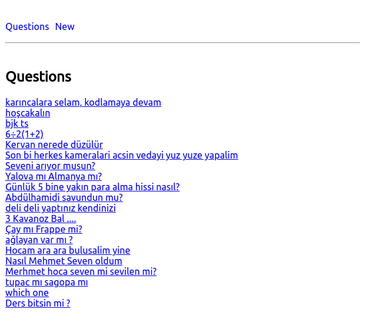
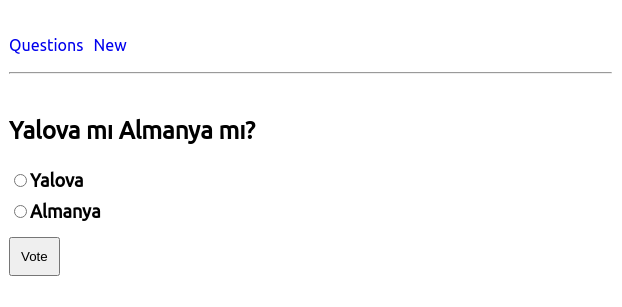
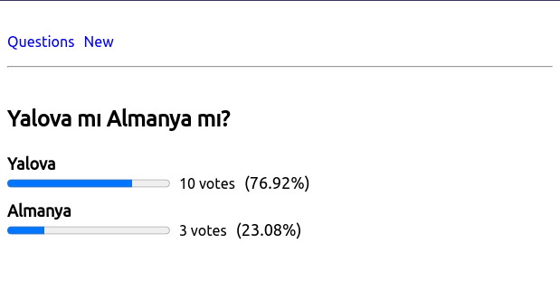
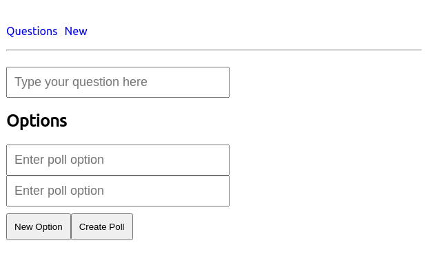

# oyluyoruz-app
> **Demo: https://oyluyoruz.netlify.app/**

Bu proje, Kodluyoruz'un düzenlediği 84. `İstanbul Earlybird Front-End Talent Bootcamp`'ı kapsamında ders içinde geliştirlmiş bir [strawpoll.me](https://www.strawpoll.me/) clone'udur. 

### Projede kullanılan teknolojiler

- **Backend:** https://hasura.io/
- **Frontend:** https://reactjs.org/ (create react app)
- **Backend Deployment:** https://www.digitalocean.com/
- **Frontend Deployment:** https://app.netlify.com/

### Proje ekran görüntüleri: 

  
   
	<em style="color: grey">Questions Lists</em>

  
   
	<em style="color: grey">Questions Show</em>

  
   
	<em style="color: grey">Questions Answers</em>

  
   
	<em style="color: grey">New Question</em>

